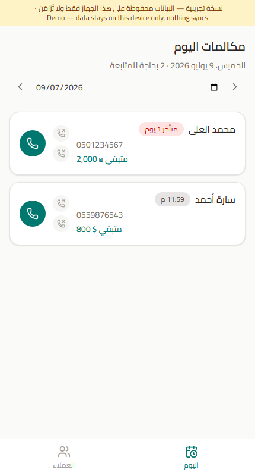
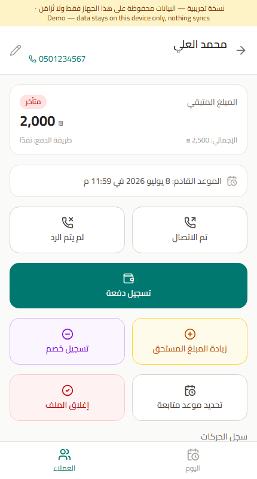
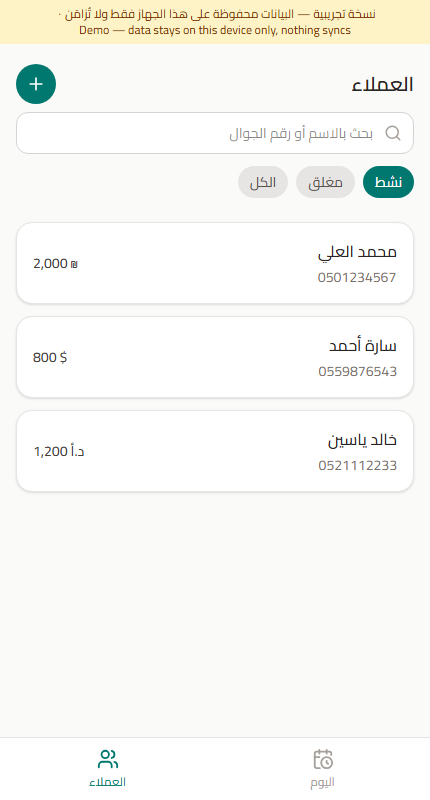

# Customer Payment Tracker · متابعة الدفعات

**🔗 Live demo: https://MohammedSunoqrot.github.io/customer-payment-tracker/**

An installable, Arabic-first Progressive Web App for tracking daily customer follow-up calls and payment collection. This is the **public, open-source demo build** — no login, no backend, no account required. Everything runs entirely in your browser and is saved to your device's local storage only.

> This is a portfolio piece adapted from a private production app I built for real personal use (which syncs across devices via Firebase). This demo version swaps that sync layer for local-only storage so anyone can try it instantly with zero setup.

<p align="center">
  
  
  
</p>

---

## English

### What it does

A daily-workflow tool for anyone who needs to call a list of customers to follow up on outstanding payments — the original use case was a small business tracking who owes money and who still needs a call today.

- **Today view** — see who's due or overdue for a call today, with a date navigator to browse any past or future day
- **Full day-by-day history, never deleted** — reschedule or mark someone contacted and they stay visible on that day's list (grayed out, marked done), instead of disappearing. Browsing a past day always shows exactly what was really on that day's docket
- **Contacted / not contacted** — a quick per-day marker that resets automatically the next day
- **Reschedule** with a specific date *and time*, quick-pick buttons for tomorrow / in 3 days / in a week
- **Record a payment** — cash, check, or other, with the actual amount deducted from the balance
- **Checks** get a due date, a personal/endorsed (شخصي / جيرو) type, and can be marked bounced (مرجع) later — which automatically reverses the deduction
- **Multi-currency, per customer** — each customer has their own currency (₪ / $ / د.أ); paying in a different currency than they're owed in prompts for a manual exchange rate and shows a live converted preview
- **Increase or deduct the amount owed** independently of a payment (e.g. a new purchase, or a discount/write-off), each recorded and shown separately in the activity history
- **Close / reopen a case** with an optional reason, recorded in history
- Installable as a real app on iPhone and Android (Add to Home Screen), works offline once loaded, right-to-left Arabic UI throughout

### Demo vs. the real app

| | This public demo | Original private app |
|---|---|---|
| Access | Open, no login | Shared passcode |
| Data storage | Browser `localStorage`, this device only | Firebase Firestore, real-time synced across every device |
| Backend | None | Firebase (Firestore + Hosting) |
| Hosting | GitHub Pages (free, static) | Firebase Hosting |

Everything else — every feature above — is identical code, just pointed at a different data layer (see [`src/lib/localDb.ts`](src/lib/localDb.ts) and [`src/lib/actions.ts`](src/lib/actions.ts)).

### Tech stack

React 19 + TypeScript + Vite · Tailwind CSS v4 · `vite-plugin-pwa` (installable PWA, offline caching) · `react-router-dom` (hash routing) · `lucide-react` icons · zero backend — a small `localStorage`-backed store using React's `useSyncExternalStore`.

### Run it yourself

```bash
git clone https://github.com/MohammedSunoqrot/customer-payment-tracker.git
cd customer-payment-tracker
npm install
npm run dev
```

Then open the printed `localhost` URL. That's it — no environment variables, no accounts, no backend to configure.

Build for production:

```bash
npm run build   # outputs to dist/
npm run preview # serve the production build locally
```

### Deploy your own copy

The repo ships with a GitHub Actions workflow ([`.github/workflows/deploy.yml`](.github/workflows/deploy.yml)) that builds and publishes to **GitHub Pages** automatically on every push to `main`. To use it on your own fork:

1. Fork this repo
2. In your fork's Settings → Pages, set the source to "GitHub Actions"
3. Update `repoBase` in [`vite.config.ts`](vite.config.ts) to match your fork's repo name
4. Push to `main` — the workflow builds and deploys automatically

**Other ways to publish a static PWA like this one**, if you'd rather not use GitHub Pages:
- **Netlify / Vercel / Cloudflare Pages** — drag-and-drop the `dist/` folder, or connect the repo for automatic deploys; all have generous free tiers and are arguably even easier than GitHub Pages for a Vite app
- **Hugging Face Spaces** — supported via the "Static" Space type (upload the built `dist/` contents); a bit unconventional for a non-ML app but works and gives it visibility on a different platform
- **Just run it locally** — since there's no backend, anyone can `git clone` + `npm run dev` and use it entirely offline on their own machine, or `npm run build` and open `dist/index.html` directly

### Why this exists

Built to show a complete, real-world PWA end to end: data modeling, offline-installable app shell, RTL/i18n-aware UI, and a swappable data layer — not just a toy CRUD demo. Part of a portfolio showcasing a range of project types.

### License

MIT — do whatever you'd like with it.

---

## العربية

### ما هو هذا التطبيق؟

تطبيق ويب تقدمي (PWA) قابل للتثبيت، بواجهة عربية بالكامل، لمتابعة مكالمات العملاء اليومية وتحصيل الدفعات. هذه هي **النسخة التجريبية المفتوحة المصدر** — بدون تسجيل دخول، وبدون خادم خلفي، وبدون أي حساب مطلوب. كل شيء يعمل بالكامل داخل المتصفح ويُحفظ محليًا على جهازك فقط.

> هذا العمل مأخوذ من تطبيق إنتاجي خاص طورته للاستخدام الشخصي الحقيقي (يتزامن عبر الأجهزة باستخدام Firebase). هذه النسخة التجريبية تستبدل طبقة المزامنة تلك بتخزين محلي فقط، ليتمكن أي شخص من تجربتها فورًا دون أي إعداد.

### ماذا يقدم التطبيق؟

- **صفحة اليوم** — عرض من يجب الاتصال بهم اليوم أو المتأخرين، مع إمكانية التنقل لعرض أي يوم سابق أو قادم
- **سجل كامل يوماً بيوم، لا يُحذف أبداً** — عند إعادة جدولة عميل أو تسجيل الاتصال به، يبقى ظاهرًا في قائمة ذلك اليوم (بلون رمادي وعلامة "تم")، بدلاً من الاختفاء. تصفح أي يوم سابق يعرض دائمًا ما كان مجدولاً فعليًا في ذلك اليوم بالضبط
- **تم الاتصال / لم يتم الرد** — علامة سريعة يومية تُصفَّر تلقائيًا في اليوم التالي
- **إعادة الجدولة** بتاريخ ووقت محددين، مع أزرار سريعة لغدًا / بعد 3 أيام / بعد أسبوع
- **تسجيل دفعة** — نقدًا أو شيك أو غير ذلك، مع خصم المبلغ الفعلي من الرصيد
- **الشيكات** لها تاريخ استحقاق، ونوع (شخصي / جيرو)، ويمكن تحديدها لاحقًا كـ"مرجع" — مما يعيد المبلغ تلقائيًا إلى الرصيد
- **عملات متعددة، لكل عميل عملته الخاصة** (₪ / $ / د.أ)؛ الدفع بعملة مختلفة عن عملة العميل يطلب سعر صرف يدوي ويعرض معاينة فورية للمبلغ المحوَّل
- **زيادة أو خصم المبلغ المستحق** بشكل مستقل عن الدفعات (مثل شراء جديد أو خصم/إعفاء)، ويُسجَّل كل منهما بشكل منفصل وواضح في سجل الحركات
- **إغلاق أو إعادة فتح ملف العميل** مع سبب اختياري، يُسجَّل في السجل
- قابل للتثبيت كتطبيق حقيقي على آيفون وأندرويد (إضافة إلى الشاشة الرئيسية)، يعمل دون اتصال بعد أول تحميل، وواجهة عربية من اليمين لليسار بالكامل

### الفرق بين هذه النسخة والتطبيق الأصلي

| | هذه النسخة التجريبية | التطبيق الخاص الأصلي |
|---|---|---|
| الدخول | مفتوح، بدون تسجيل | رمز دخول مشترك |
| تخزين البيانات | محليًا في المتصفح، هذا الجهاز فقط | Firebase Firestore، مزامنة فورية بين كل الأجهزة |
| الخادم الخلفي | لا يوجد | Firebase (Firestore + Hosting) |
| الاستضافة | GitHub Pages (مجانية) | Firebase Hosting |

باقي كل شيء — كل ميزة مذكورة أعلاه — هو نفس الكود تمامًا، موجّه فقط إلى طبقة بيانات مختلفة.

### كيفية التشغيل بنفسك

```bash
git clone https://github.com/MohammedSunoqrot/customer-payment-tracker.git
cd customer-payment-tracker
npm install
npm run dev
```

ثم افتح رابط `localhost` الذي يظهر. هذا كل شيء — بدون متغيرات بيئة، بدون حسابات، بدون أي إعداد لخادم خلفي.

### لماذا صُنع هذا التطبيق؟

لعرض تطبيق ويب تقدمي كامل من الألف إلى الياء: تصميم بيانات، تطبيق قابل للتثبيت والعمل دون اتصال، واجهة عربية من اليمين لليسار، وطبقة بيانات قابلة للاستبدال — وليس مجرد نموذج CRUD بسيط. جزء من معرض أعمال يعرض تنوّع المشاريع.

### الترخيص

MIT — استخدمه كما تشاء.
